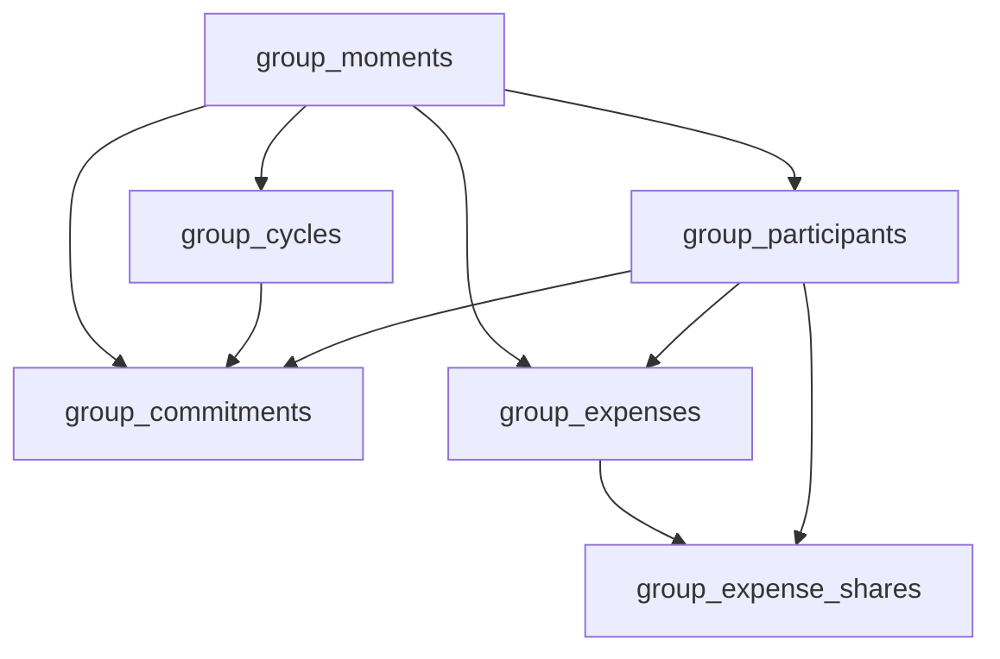

# Group module — SQL, backend, and frontend

This document maps how the **group** (shared moments / pooled trips) feature is implemented across the database, FastAPI layer, and Next.js app.

---

## Conceptual model

- **Moment (`group_moments`)** — A group space: title, type, funding model (`pooled`, `split_expenses`, `hybrid`), split rule, target budget, status.
- **Participants (`group_participants`)** — People in the group; `role` is `admin` or `member`; `status` includes `active`, `invited`, `removed`. Invite tokens / email live here.
- **Cycles (`group_cycles`)** — Time buckets (e.g. monthly) with optional `target_amount` and `collected_amount`.
- **Commitments (`group_commitments`)** — Each member’s **planned** vs **paid** contribution toward the pool for a cycle. This drives **Positions** and “collected” summaries. Rows can be typed (`commitment_type`) and sourced (`source`, e.g. `admin_set`, `expense_split`).
- **Expenses (`group_expenses` + `group_expense_shares`)** — Shared bills: who paid, how much each person owes. **Separate** from commitment balances; expense “paid by” does not automatically equal “paid contribution” unless you record it on commitments.

---

## SQL (Supabase migrations)

Migrations live under [`supabase/migrations/group/`](supabase/migrations/group/).

| File | Purpose |
|------|---------|
| [`20260410120000_group_module.sql`](supabase/migrations/group/20260410120000_group_module.sql) | Core tables: `group_moments`, `group_cycles`, `group_participants`, `group_commitments`, `group_expenses`, `group_expense_shares`, `group_settlements`, `group_reminders`, `group_activity`, `group_signals`. Indexes, `updated_at` triggers, RLS enabled on all. |
| [`20260415120000_group_invite_columns.sql`](supabase/migrations/group/20260415120000_group_invite_columns.sql) | `invite_email`, `invite_token`, `invite_sent_at` on `group_participants`; unique partial index on `invite_token`. |
| [`20260416120000_group_recurring_expenses.sql`](supabase/migrations/group/20260416120000_group_recurring_expenses.sql) | Recurring expense templates (see migration for table shape). |
| [`20260418120000_group_intelligence_layer.sql`](supabase/migrations/group/20260418120000_group_intelligence_layer.sql) | Intelligence / home signals support (see migration). |
| [`20260419120000_group_commitment_lifecycle.sql`](supabase/migrations/group/20260419120000_group_commitment_lifecycle.sql) | `commitment_type`, `source`, optional `expense_id` on `group_commitments`. |

**Identifiers:** `created_by`, participant `user_id`, and activity `actor_id` reference Firebase UIDs stored as `text` (aligned with `profiles.id`).

**Access:** The backend uses the **service-role** Supabase client (PostgREST), not end-user RLS for app logic; ownership and role checks are enforced in Python (`assert_member`, `assert_admin_group`, etc.).

---

## Backend

### Layout

| Area | Path |
|------|------|
| HTTP routes | [`backend/app/routers/group.py`](backend/app/routers/group.py) — prefix `/group` |
| Domain logic | [`backend/app/services/group_service.py`](backend/app/services/group_service.py) |
| Home / intelligence | [`backend/app/services/group_intelligence_service.py`](backend/app/services/group_intelligence_service.py) |
| Pydantic models | [`backend/app/schemas/group.py`](backend/app/schemas/group.py) |
| Intelligence schemas | [`backend/app/schemas/group_intelligence.py`](backend/app/schemas/group_intelligence.py) |

### Auth

- Requests send `Authorization: Bearer <Firebase ID token>`.
- `get_current_user_id` supplies the Firebase UID string.
- Typical checks:
  - **`assert_member`** — user is an active participant (or allowed invite flow).
  - **`assert_admin_group`** — user is a participant with `role == admin`.

### Error mapping

[`_http_from_service_err`](backend/app/routers/group.py) maps `PermissionError` / `ValueError` codes to HTTP status and messages (e.g. `admin_only`, `not_a_member`, `last_admin`, invite errors).

### Route inventory (high level)

All under **`/group`** (see [`group.py`](backend/app/routers/group.py) for exact methods and bodies).

| Area | Endpoints (pattern) |
|------|---------------------|
| Invites | `GET /invites/preview`, `POST /invites/accept` |
| Home / intelligence | `GET /home`, `/home/today`, `/home/summary`, `/home/recommendations`, `/home/signals`, `/home/nudges`, `/home/health`, `/home/movement` |
| Moments | `POST /moments`, `GET /moments`, `GET/PATCH/DELETE /moments/{group_id}` |
| Participants | `POST /moments/{group_id}/participants` (admin), invite send, `PATCH/DELETE .../participants/{id}` |
| Cycles | `GET/POST /moments/{group_id}/cycles`, `POST .../cycles/generate-next`, `GET .../cycle-status` |
| Commitments | `GET/POST/PATCH/DELETE .../commitments`, `POST .../commitments/{id}/pay` |
| Positions | `GET /moments/{group_id}/positions` — aggregates commitments per participant |
| Expenses | `GET/POST .../expenses` |
| Recurring | `GET/POST/PATCH/DELETE .../recurring-expenses`, `POST .../recurring-expenses/apply` |
| Other | `POST .../settlements`, `GET .../activity`, `GET/POST .../signals`, `POST .../reminders` |

**Notable service behaviors** (see `group_service.py`):

- **`get_positions`** — Sums `committed_amount` / `paid_amount` from `group_commitments` per participant; does not join expense tables for “who paid” on bills.
- **`record_commitment_payment`** — Increments `paid_amount` on a commitment; member-level gate unless you add stricter checks elsewhere.
- **`add_participant`** / **`send_participant_invite`** — Admin-gated for adding people and minting join URLs / email.

---

## Frontend

### API client

Typed fetch helpers live in [`frontend/lib/api/group.ts`](frontend/lib/api/group.ts). All group calls should go through these functions so URLs and types stay consistent.

### App routes

| Route | Role |
|-------|------|
| [`frontend/app/group/page.tsx`](frontend/app/group/page.tsx) | Group list / hub |
| [`frontend/app/group/new/`](frontend/app/group/new/) | Create flow |
| [`frontend/app/group/[groupId]/`](frontend/app/group/[groupId]/) | Group detail (tabs) |
| [`frontend/app/group/join/page.tsx`](frontend/app/group/join/page.tsx) | Accept invite via token |

### Main UI shell

[`frontend/components/group/group-detail-layout.tsx`](frontend/components/group/group-detail-layout.tsx) — Loads moment detail, commitments, expenses, positions, activity; tabs: Overview, Commitments, Positions, Expenses, Activity; computes `isGroupAdmin` from participants; payment modal for recording commitment payments.

### Other components (by concern)

| Concern | Files (under `frontend/components/group/`) |
|---------|--------------------------------------------|
| People & invites | `group-invite-panel.tsx`, `group-coordination-people.tsx`, `participant-table.tsx` |
| Coordination strip | `group-coordination-action-strip.tsx`, `group-cycle-coordination-block.tsx` |
| Expenses | `expense-list.tsx`, `recurring-expenses-panel.tsx` |
| Group home | `group-home-dashboard.tsx`, `today-groups-section.tsx`, `pending-commitments-*`, `group-health-section.tsx`, … |
| Creation | `group-creation-wizard.tsx` |
| Shared copy / layout | `group-console-shared.tsx`, `group-split-rule-card.tsx`, `activity-timeline.tsx` |

### Supporting logic

| File | Purpose |
|------|---------|
| [`frontend/lib/group/group-detail-coordination.ts`](frontend/lib/group/group-detail-coordination.ts) | Rollups, coordination health, commitment scoping by cycle |
| [`frontend/lib/group/join-url.ts`](frontend/lib/group/join-url.ts) | Normalizing join URLs for display / QR |

### UX rules (implemented in UI)

- **Invites / add participants** — Exposed to **admins**; non-admins see copy that only admins can add people and generate links.
- **Record payment (commitments)** — **Admin** can record for any member; **non-admin** typically sees **Record payment** only on **their** commitment row; Overview people cards align **Remind** (admin) and **Mark paid** (admin or self).
- **Positions** — Shows **pool commitment** totals, not expense settlement totals; copy on the Positions tab clarifies vs the Expenses tab.

---

## Keeping this doc accurate

When you add tables, routes, or screens:

1. Update the relevant **migration** section and table list.
2. Append new **backend** routes and service functions.
3. Add **frontend** routes/components or API functions.

---

*Last aligned with repo structure; verify against `routers/group.py` and `lib/api/group.ts` when in doubt.*
